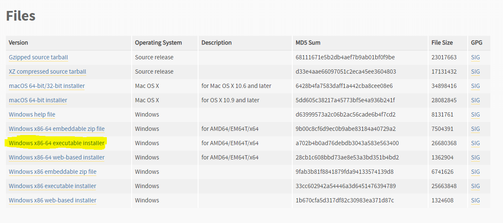

# Cómo controlar archivos con python

El código del programa que está en este repositorio, tiene la intención de hacer modificaciones a clientes, ya sea crear, actualizar, eliminar o mostrarlos. Es cómo si fuera una "base de dato"

Para ejecutar el archivo, es necesario que tengas instalado python en tu ordenador. La versión que use para la creación de este código fue la 3.7.4. El programa lo puedes descargar desde la página de python dando clic [Aquí](https://www.python.org/downloads/release/python-374/); y descargas el archivo que esta subrayado así como se muestra en la imagen que está en la parte de abajo.

El proseso de instalación no es muy difícil, así que espero y no tengas algun problema en ello.
